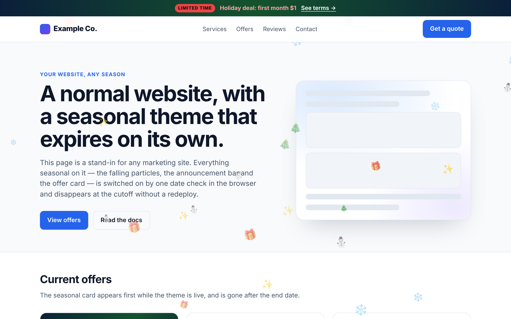
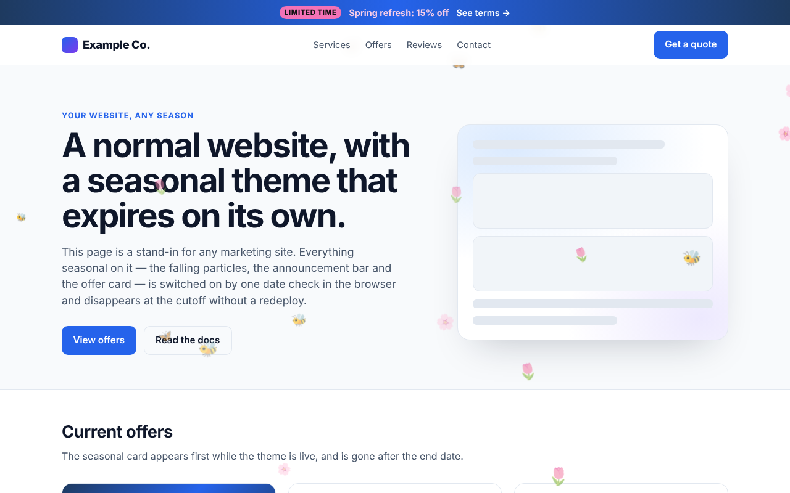
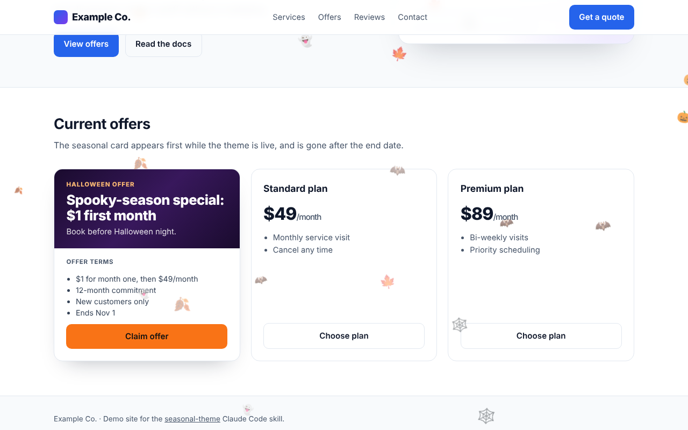
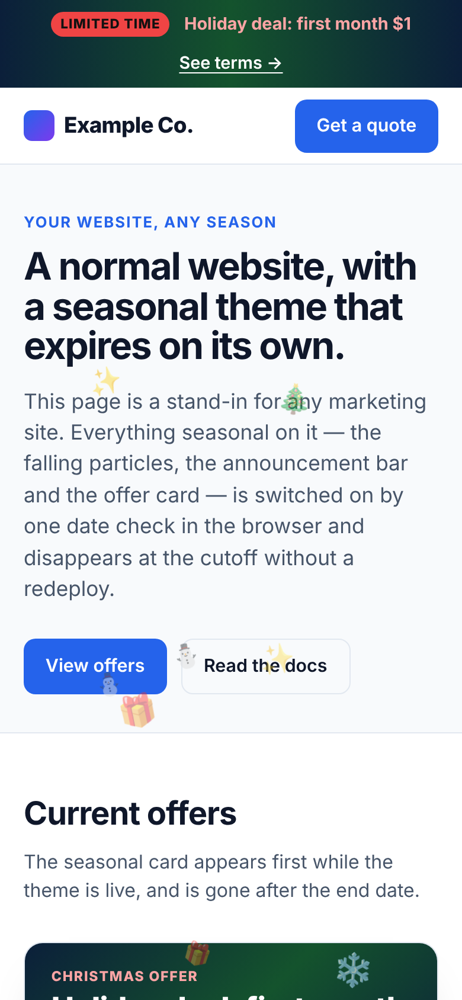

# ❄️ seasonal-theme: self-expiring holiday themes for any website

A [Claude Code](https://docs.claude.com/en/docs/claude-code/overview) skill that adds a seasonal theme to any **React/Next.js (Vercel) or static website** with one command: falling weather effects, a themed announcement bar and an offer card with compliant terms.

The expiry date is **hardcoded and checked in the visitor's browser**, so the theme disappears for every visitor on the end date, even if the site is never redeployed.

**[📖 Docs site](https://itzkiro.github.io/Raid-Contractor-Marketing-Wesbite-Themes/)** · **[🎮 Live demo](https://itzkiro.github.io/Raid-Contractor-Marketing-Wesbite-Themes/demo/)** · **[📄 SKILL.md](skills/seasonal-theme/SKILL.md)**



---

## Contents

- [What it is](#what-it-is)
- [Quick start](#quick-start)
- [Installation](#installation)
- [Commands](#commands)
- [Options](#options)
- [Season catalog](#season-catalog)
- [Screenshots](#screenshots)
- [Why it's safe for production](#why-its-safe-for-production)
- [License](#license)

## What it is

The skill installs three coordinated, **time-boxed** layers. Each works on its own, and all three share one date gate:

| Layer | What it does |
|---|---|
| 🌨️ **Weather effect** | Falling animated emoji particles over every page, in pure CSS. No library, no network request. |
| 📣 **Announcement bar re-skin** | Seasonal gradient and promo headline on your existing bar. The normal bar comes back on its own after the end date. |
| 🏷️ **Offer card** | A promo card on your offers/landing page with the terms (price, commitment, exclusions, end date) printed beside the claim. |

After the end date the code renders nothing anywhere. Removing it is cleanup, not an emergency.

## Quick start

```bash
# 1. In your website repo, add the skill
npx degit Itzkiro/Raid-Contractor-Marketing-Wesbite-Themes/skills/seasonal-theme .claude/skills/seasonal-theme

# 2. Start Claude Code
claude
```

```text
# 3. Ask for a season
> /seasonal-theme christmas --promo "Holiday deal: first month $1" --promo-href /offers --terms "$1 month one, then $49/mo; 12-month commitment; new customers only"
```

Claude then:

1. Scouts your repo (framework, layout, announcement bar, z-indexes, bare/landing routes, offers page).
2. Converts the end date to a UTC cutoff and tells you the exact expiry moment.
3. Installs the components.
4. Checks them in a headless browser with the real clock and with a clock faked past the cutoff.
5. Commits with the expiry date in the message.

You can also ask in plain words, e.g. *"put up the Christmas theme"*, *"make it snow"* or *"Valentine's hearts please"*.

## Installation

Every method puts the skill at `.claude/skills/seasonal-theme/SKILL.md` in your project. Commit it so the whole team gets the command.

**a) degit (one-liner, recommended)**

```bash
npx degit Itzkiro/Raid-Contractor-Marketing-Wesbite-Themes/skills/seasonal-theme .claude/skills/seasonal-theme
```

**b) Copy**

```bash
git clone https://github.com/Itzkiro/Raid-Contractor-Marketing-Wesbite-Themes.git ~/seasonal-theme-skill
mkdir -p .claude/skills && cp -r ~/seasonal-theme-skill/skills/seasonal-theme .claude/skills/
```

**c) Git submodule** (pinned; update with `git submodule update --remote`)

```bash
git submodule add https://github.com/Itzkiro/Raid-Contractor-Marketing-Wesbite-Themes.git .claude/vendor/seasonal-theme-skill
mkdir -p .claude/skills && ln -s ../vendor/seasonal-theme-skill/skills/seasonal-theme .claude/skills/seasonal-theme
```

**d) For every project on your machine** (user-level skill)

```bash
npx degit Itzkiro/Raid-Contractor-Marketing-Wesbite-Themes/skills/seasonal-theme ~/.claude/skills/seasonal-theme
```

**Check that it loaded:** start `claude` in the project and type `/`. `seasonal-theme` should be in the list. If it's missing, make sure the path is exactly `.claude/skills/seasonal-theme/SKILL.md` and start a new session.

## Commands

| Command | Action |
|---|---|
| `/seasonal-theme <season> [options]` | Install that season's theme from the [catalog](#season-catalog). |
| `/seasonal-theme off` | Remove the seasonal code entirely. It is inert after expiry either way. |
| `/seasonal-theme status` | Report which theme is installed, its end date, and whether it is currently live for visitors. |

### Recipes

```text
# Weather only
/seasonal-theme snow --ends 2027-01-15 --tz America/Chicago

# Full campaign: weather + bar + offer card
/seasonal-theme halloween --promo "Spooky-season special: $1 first month" --promo-href /offers --terms "$1 month one, then $49/mo; 12-month commitment; new customers only"

# Promo bar only
/seasonal-theme valentines --promo "Refer a friend, both save $25" --no-weather --no-card

# Subtle effect for a busy site
/seasonal-theme autumn --density low --no-bar --no-card

# Custom end date and time zone
/seasonal-theme summer --ends 2027-09-02 --tz Europe/London --promo "Summer kickoff: $1 first month"

# Check what's live, then take it down
/seasonal-theme status
/seasonal-theme off
```

## Options

| Flag | Value | Effect |
|---|---|---|
| `--ends` | `YYYY-MM-DD` | Override the default end date. The theme expires at 00:00 local in `--tz` on that date. |
| `--tz` | IANA zone, e.g. `America/New_York` | Time zone for the cutoff. Converted to a UTC timestamp, accounting for DST. |
| `--promo` | `"TEXT"` | Promo headline for the announcement bar and offer card. |
| `--promo-href` | path, e.g. `/offers` | Where the bar's promo links to. |
| `--terms` | `"a; b; c"` | Semicolon-separated offer terms, printed on the card beside the claim. |
| `--density` | `low` \| `normal` \| `high` | Particle count: roughly 10 / 20 / 32 on desktop, half on phones. |
| `--no-weather` | — | Skip the falling-particle layer. |
| `--no-bar` | — | Leave the announcement bar unchanged. |
| `--no-card` | — | Skip the offer card. |

## Season catalog

Defaults; all overridable.

| Season key | Particles | Bar gradient (from → via → to) | Accent | Default end (local) |
|---|---|---|---|---|
| `halloween` | 🎃 🦇 👻 🍂 🍁 🕸️ | `#1a0b2e → #38185c → #1a0b2e` | `text-orange-300` / badge `bg-orange-500` | Nov 1 |
| `christmas` | ❄️ 🎄 ⛄ 🎁 ✨ | `#0b1f3a → #14532d → #0b1f3a` | `text-red-300` / badge `bg-red-500` | Dec 26 |
| `new-year` | ✨ 🎆 ⭐ 🥂 | `#111111 → #3b2f0b → #111111` | `text-yellow-300` / badge `bg-yellow-400` | Jan 2 |
| `valentines` | ❤️ 💘 💝 🌹 | `#4c0519 → #881337 → #4c0519` | `text-pink-300` / badge `bg-pink-500` | Feb 15 |
| `st-patricks` | ☘️ 🍀 ✨ | `#052e16 → #166534 → #052e16` | `text-green-300` / badge `bg-green-500` | Mar 18 |
| `spring` | 🌸 🌷 🦋 🐝 | `#1e3a5f → #2563eb → #1e3a5f` | `text-pink-200` / badge `bg-pink-400` | configurable |
| `summer` | ☀️ 🌊 🍉 😎 | `#0c4a6e → #0891b2 → #0c4a6e` | `text-yellow-200` / badge `bg-yellow-400` | configurable |
| `autumn` | 🍂 🍁 🌰 | `#431407 → #9a3412 → #431407` | `text-amber-200` / badge `bg-amber-500` | Nov 30 |
| `snow` | ❄️ (only) | keep site bar | — | configurable |
| `rain` | 💧 (only) | keep site bar | — | configurable |

`snow` and `rain` default to `--no-bar --no-card` (pure weather).

## Screenshots

These are from the [live demo](https://itzkiro.github.io/Raid-Contractor-Marketing-Wesbite-Themes/demo/), a generic site running the skill's vanilla reference script. Click a season to open it in the demo.

### Every theme

| | | |
|:-:|:-:|:-:|
| [](https://itzkiro.github.io/Raid-Contractor-Marketing-Wesbite-Themes/demo/?season=halloween)<br>`halloween` | [](https://itzkiro.github.io/Raid-Contractor-Marketing-Wesbite-Themes/demo/?season=christmas)<br>`christmas` | [](https://itzkiro.github.io/Raid-Contractor-Marketing-Wesbite-Themes/demo/?season=new-year)<br>`new-year` |
| [](https://itzkiro.github.io/Raid-Contractor-Marketing-Wesbite-Themes/demo/?season=valentines)<br>`valentines` | [](https://itzkiro.github.io/Raid-Contractor-Marketing-Wesbite-Themes/demo/?season=st-patricks)<br>`st-patricks` | [](https://itzkiro.github.io/Raid-Contractor-Marketing-Wesbite-Themes/demo/?season=spring)<br>`spring` |
| [](https://itzkiro.github.io/Raid-Contractor-Marketing-Wesbite-Themes/demo/?season=summer)<br>`summer` | [](https://itzkiro.github.io/Raid-Contractor-Marketing-Wesbite-Themes/demo/?season=autumn)<br>`autumn` | [](https://itzkiro.github.io/Raid-Contractor-Marketing-Wesbite-Themes/demo/?season=snow)<br>`snow` |
| [](https://itzkiro.github.io/Raid-Contractor-Marketing-Wesbite-Themes/demo/?season=rain)<br>`rain` | | |

### Offer card with terms beside the claim



### Before and after the cutoff (same build)

| Live (`Date.now() < ENDS_UTC`) | Clock faked past the cutoff |
|:-:|:-:|
|  |  |

### Mobile (half density) and density levels

| Phone, 390px | `--density low` | `--density high` |
|:-:|:-:|:-:|
|  |  |  |

<details>
<summary>Regenerate the screenshots</summary>

```bash
npm i -D playwright   # or use a global install
node scripts/screenshots.mjs
```

</details>

## Why it's safe for production

These rules come from production incidents. The skill makes Claude follow all of them on every install:

- **Client-side UTC date gate.** The cutoff is a hardcoded UTC timestamp compared with `Date.now()` in the browser. A server-side check on a static/SSG page is frozen at build time and never expires.
- **Mount-only rendering.** Server HTML never contains the theme, so there's no hydration mismatch and no SEO footprint.
- **`pointer-events: none` overlay.** It's fixed and clipped, with a z-index below your modals, cookie banners and sticky CTAs.
- **Hidden under `prefers-reduced-motion`.**
- **Skipped on conversion-critical routes.** Bare ad-landing and checkout pages stay clean, using the site's existing exclusion helper.
- **Half density on phones** (viewports under 640px).
- **`try/catch` around all storage.** Bare `localStorage` access throws in blocked cross-origin iframes and can take the whole page down.
- **Promo terms printed beside the claim.** Commitment, exclusions and end date go on the same card as the price headline. No fine-print pages.

The full rules and the React/Next.js and vanilla JS reference implementations are in [`skills/seasonal-theme/SKILL.md`](skills/seasonal-theme/SKILL.md), which is the canonical source.

## Repository layout

```
skills/seasonal-theme/SKILL.md   ← the skill (copy this into .claude/skills/)
docs/                            ← GitHub Pages site + live demo + screenshots
scripts/screenshots.mjs          ← regenerates docs/assets/screenshots
```

## License

[MIT](LICENSE)
